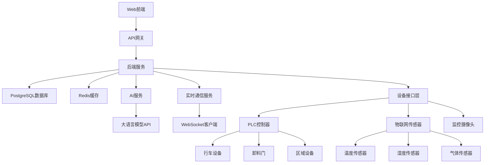

# Design Document: 垃圾储坑智能化管控系统 (Intelligent Garbage Pit Management System)

## Overview

垃圾储坑智能化管控系统是一个用于城市生活垃圾处理厂中垃圾储坑管理的综合智能化系统。该系统通过集成物联网传感器、实时监控设备、人工智能分析和自动化控制系统，实现对垃圾储坑的全方位智能化管理，包括垃圾投料、翻堆、发酵监测、大物体预警、设备监控和调度优化等功能。

系统旨在提高垃圾处理效率，降低人工操作风险，优化资源利用，确保生产过程的安全性和环保性。通过3D可视化展示和实时数据分析，为操作人员提供直观的操作界面和决策支持。

## Architecture

### 整体系统架构



### 技术架构层次

1. **表示层**: Vue.js前端应用，提供Web界面和3D可视化
2. **应用层**: Node.js后端服务，处理业务逻辑和API请求
3. **服务层**: 包括认证服务、设备管理、任务调度、告警服务等
4. **数据层**: PostgreSQL关系数据库存储结构化数据，Redis缓存实时状态
5. **集成层**: 与PLC设备、物联网传感器、监控摄像头交互
6. **AI层**: 集成AI服务进行数据分析、预测和优化建议

## Components and Interfaces

### 用户管理组件

**接口定义:**
```typescript
interface IUserService {
  // 用户认证
  authenticate(username: string, password: string): Promise<AuthResult>;
  refreshToken(refreshToken: string): Promise<AuthResult>;
  logout(userId: number): Promise<void>;
  
  // 用户管理
  createUser(userData: CreateUserDto): Promise<User>;
  updateUser(userId: number, userData: UpdateUserDto): Promise<User>;
  deleteUser(userId: number): Promise<void>;
  getUserById(userId: number): Promise<User>;
  getUsers(page: number, limit: number): Promise<PagedResult<User>>;
  
  // 权限检查
  checkPermission(userId: number, permission: string): Promise<boolean>;
}

// 用户数据传输对象
interface CreateUserDto {
  username: string;
  password: string;
  email?: string;
  realName: string;
  roleId: number;
}

interface UpdateUserDto {
  email?: string;
  phone?: string;
  realName?: string;
  roleId?: number;
  status?: UserStatus;
}
```

### 行车管理组件

**接口定义:**
```typescript
interface ICraneService {
  // 行车状态管理
  getCraneList(): Promise<Crane[]>;
  getCraneStatus(craneId: number): Promise<CraneStatus>;
  updateCraneStatus(craneId: number, status: CraneStatusDto): Promise<CraneStatus>;
  
  // 行车控制
  controlCrane(craneId: number, command: CraneCommandDto): Promise<ControlResult>;
  setCraneMode(craneId: number, mode: CraneMode): Promise<void>;
  setCraneDuty(craneId: number, duty: string): Promise<void>;
  
  // 告警管理
  getCraneAlarms(craneId: number, filter?: AlarmFilterDto): Promise<CraneAlarm[]>;
  acknowledgeAlarm(alarmId: number, userId: number): Promise<void>;
  resolveAlarm(alarmId: number, resolution: string): Promise<void>;
}

interface CraneStatusDto {
  status: CraneStatusType;
  mode: CraneMode;
  currentPosition?: Position;
  grabStatus?: GrabStatus;
  loadWeight?: number;
  speed?: number;
}

interface CraneCommandDto {
  action: CraneAction;
  direction?: Direction;
  speed?: number;
  targetPosition?: Position;
}
```

### 区域管理组件

**接口定义:**
```typescript
interface IAreaService {
  // 区域管理
  createArea(areaData: CreateAreaDto): Promise<Area>;
  updateArea(areaId: number, areaData: UpdateAreaDto): Promise<Area>;
  deleteArea(areaId: number): Promise<void>;
  getAreaList(filter?: AreaFilterDto): Promise<Area[]>;
  getAreaById(areaId: number): Promise<AreaDetails>;
  
  // 区域控制
  controlAreaDevices(areaId: number, controlData: AreaControlDto): Promise<ControlResult>;
  getAreaStatus(areaId: number): Promise<AreaStatus>;
  
  // 数据查询
  getFermentationData(areaId: number, timeRange: TimeRange): Promise<FermentationDataPoint[]>;
  getInventoryData(areaId: number): Promise<InventoryData>;
}

interface CreateAreaDto {
  areaNo: string;
  name: string;
  type: AreaType;
  coordinateX: number;
  coordinateY: number;
  width: number;
  height: number;
  depth: number;
  maxHeight: number;
}

interface AreaControlDto {
  coverStatus?: CoverStatus;
  drainingStatus?: DrainStatus;
  cleaningStatus?: CleanStatus;
}
```

### 任务调度组件

**接口定义:**
```typescript
interface ITaskService {
  // 任务管理
  createTask(taskData: CreateTaskDto): Promise<Task>;
  cancelTask(taskId: number, reason?: string): Promise<void>;
  getTaskList(filter?: TaskFilterDto): Promise<Task[]>;
  getTaskStatistics(timeRange: TimeRange): Promise<TaskStatistics>;
  
  // 调度指令
  createDispatchInstruction(taskId: number, instructionData: DispatchInstructionDto): Promise<DispatchInstruction>;
  executeInstruction(instructionId: number): Promise<ExecutionResult>;
  
  // 调度优化
  getOptimizationRecommendations(optimizationRequest: OptimizationRequestDto): Promise<OptimizationRecommendation[]>;
  autoScheduleTasks(scheduleData: AutoScheduleDto): Promise<Task[]>;
}

interface CreateTaskDto {
  craneId: number;
  taskType: TaskType;
  sourceAreaId: number;
  targetAreaId: number;
  priority: number;
  weight: number;
  scheduledTime?: Date;
}
```

### AI服务组件

**接口定义:**
```typescript
interface IAIService {
  // 数据分析
  analyzeFermentationData(areaId: number, data: FermentationData): Promise<FermentationAnalysisResult>;
  predictFermentationTrends(areaId: number, timeHorizon: string): Promise<FermentationPrediction>;
  
  // 告警诊断
  diagnoseAlarm(alarmId: number, context: AlarmContext): Promise<AlarmDiagnosisResult>;
  
  // 图像识别
  detectLargeObjects(imageUrl: string, cameraContext: CameraContext): Promise<ObjectDetectionResult>;
  
  // 调度优化
  optimizeTaskSchedule(currentState: SystemState): Promise<ScheduleOptimizationResult>;
  generateSmartRecommendations(context: RecommendationContext): Promise<Recommendation[]>;
}

interface FermentationAnalysisResult {
  analysisDate: Date;
  areaId: number;
  riskLevel: RiskLevel;
  recommendations: string[];
  optimalActions: Action[];
  predictedCompletionTime?: Date;
  confidence: number;
}

interface AlarmDiagnosisResult {
  alarmId: number;
  possibleCauses: Cause[];
  recommendedActions: Action[];
  priority: Priority;
  estimatedRepairTime?: string;
  requiredParts?: string[];
}
```

### 实时监控组件

**接口定义:**
```typescript
interface IMonitorService {
  // 实时状态
  getRealTimeStatus(): Promise<SystemStatus>;
  subscribeToUpdates(channel: string, callback: (data: any) => void): Promise<Subscription>;
  unsubscribeFromUpdates(subscriptionId: string): Promise<void>;
  
  // 摄像头管理
  getCameraList(): Promise<Camera[]>;
  getCameraStatus(cameraId: number): Promise<CameraStatus>;
  captureImage(cameraId: number): Promise<ImageCaptureResult>;
  
  // 数据流
  startDataStream(streamConfig: StreamConfig): Promise<DataStream>;
  stopDataStream(streamId: string): Promise<void>;
}

interface SystemStatus {
  timestamp: Date;
  cranes: CraneStatus[];
  areas: AreaStatus[];
  tasks: TaskStatus[];
  alarms: AlarmStatus[];
  overallHealth: SystemHealth;
  efficiency: EfficiencyMetrics;
}
```

## Data Models

### 核心数据模型

```typescript
// 用户模型
interface User {
  id: number;
  username: string;
  email?: string;
  phone?: string;
  realName: string;
  roleId: number;
  status: UserStatus;
  lastLoginAt?: Date;
  createdAt: Date;
  updatedAt: Date;
}

// 角色模型
interface Role {
  id: number;
  name: string;
  code: string;
  description?: string;
  permissions: string[];
  createdAt: Date;
  updatedAt: Date;
}

// 行车模型
interface Crane {
  id: number;
  craneNo: string;
  name: string;
  status: CraneStatus;
  mode: CraneMode;
  currentPosition: Position;
  grabStatus: GrabStatus;
  loadWeight?: number;
  speed?: number;
  duty: string;
  isEnabled: boolean;
  emergencyStop: boolean;
  lastMaintenanceDate?: Date;
  createdAt: Date;
  updatedAt: Date;
}

// 区域模型
interface Area {
  id: number;
  areaNo: string;
  name: string;
  type: AreaType;
  coordinateX: number;
  coordinateY: number;
  width: number;
  height: number;
  depth: number;
  currentHeight: number;
  maxHeight: number;
  coverStatus: CoverStatus;
  drainingStatus: DrainStatus;
  cleaningStatus: CleanStatus;
  createdAt: Date;
  updatedAt: Date;
}

// 任务模型
interface Task {
  id: number;
  taskNo: string;
  craneId: number;
  taskType: TaskType;
  sourceAreaId: number;
  targetAreaId: number;
  status: TaskStatus;
  priority: number;
  weight: number;
  startTime?: Date;
  endTime?: Date;
  duration?: number;
  createdBy: number;
  createdAt: Date;
  updatedAt: Date;
}

// 告警模型
interface CraneAlarm {
  id: number;
  craneId: number;
  alarmType: AlarmType;
  alarmLevel: AlarmLevel;
  message: string;
  position?: Position;
  sensorData?: SensorData;
  status: AlarmStatus;
  acknowledgedBy?: number;
  acknowledgedAt?: Date;
  resolvedAt?: Date;
  createdAt: Date;
}

// 发酵数据模型
interface FermentationData {
  id: number;
  areaId: number;
  temperature: number;
  humidity: number;
  methaneConcentration: number;
  phValue: number;
  oxygenConcentration: number;
  recordedAt: Date;
}

// 库存数据模型
interface InventoryData {
  id: number;
  areaId: number;
  totalWeight: number;
  garbageType: string;
  stackingHeight: number;
  density: number;
  recordedAt: Date;
}
```

### 枚举类型定义

```typescript
// 用户状态
enum UserStatus {
  ACTIVE = 'active',
  INACTIVE = 'inactive',
  LOCKED = 'locked'
}

// 行车状态
enum CraneStatus {
  ONLINE = 'online',
  OFFLINE = 'offline',
  RUNNING = 'running',
  STANDBY = 'standby',
  FAULT = 'fault'
}

// 行车模式
enum CraneMode {
  AUTO = 'auto',
  MANUAL = 'manual'
}

// 抓斗状态
enum GrabStatus {
  OPEN = 'open',
  CLOSED = 'closed',
  MOVING = 'moving'
}

// 区域类型
enum AreaType {
  STACKING = 'stacking',
  FEEDING = 'feeding',
  TRANSFER = 'transfer'
}

// 任务类型
enum TaskType {
  FEEDING = 'feeding',
  STACKING = 'stacking',
  TURNING = 'turning',
  MOVING = 'moving'
}

// 任务状态
enum TaskStatus {
  PENDING = 'pending',
  RUNNING = 'running',
  COMPLETED = 'completed',
  CANCELLED = 'cancelled'
}

// 告警级别
enum AlarmLevel {
  CRITICAL = 'critical',
  MAJOR = 'major',
  MINOR = 'minor'
}

// 告警状态
enum AlarmStatus {
  ACTIVE = 'active',
  ACKNOWLEDGED = 'acknowledged',
  RESOLVED = 'resolved'
}

// 覆盖状态
enum CoverStatus {
  OPEN = 'open',
  CLOSED = 'closed'
}

// 排水状态
enum DrainStatus {
  OPEN = 'open',
  CLOSED = 'closed'
}

// 清理状态
enum CleanStatus {
  OPEN = 'open',
  CLOSED = 'closed'
}
```

## Correctness Properties

### Property 1: 认证与授权正确性

**描述**: 所有API请求必须包含有效的JWT令牌，用户只能访问被授权的资源，角色权限必须层级递进。

**Validates: Requirements 24, 25, 26**

**前置条件**: 
- 用户已登录系统并获取有效JWT令牌
- 系统定义了角色和权限的层级关系

**后置条件**:
- 无效令牌的请求返回401 Unauthorized错误
- 未授权访问的请求返回403 Forbidden错误
- 高级角色自动继承低级角色的所有权限

**测试方法**:
1. 发送无令牌请求验证返回401
2. 使用低权限用户访问高权限接口验证返回403
3. 验证管理员角色包含操作员的所有权限

**形式化表示**:
```pseudocode
FOR ALL users u, roles r
IF u.role_id = r.id AND r.permissions ⊆ permissions
THEN u.permissions ⊆ r.permissions
```

### Property 2: 设备状态一致性

**描述**: 行车的当前状态必须在数据库中与实时状态同步，区域设备状态必须与实际物理状态一致。

**Validates: Requirements 6, 9, 12, 13, 14, 15**

**前置条件**:
- 行车设备连接到PLC控制系统
- 区域设备（覆盖、排水、清理）具有状态反馈传感器

**后置条件**:
- 数据库中的行车状态与PLC读取状态相同
- UI显示的区域设备状态与传感器反馈状态一致
- 状态更新延迟不超过100ms

**测试方法**:
1. 修改PLC行车状态，验证数据库同步更新
2. 控制区域设备，验证UI状态实时更新
3. 测量状态更新延迟时间

**形式化表示**:
```pseudocode
FOR ALL cranes c, crane_status s
IF EXISTS (SELECT * FROM cranes WHERE id = c.id)
THEN EXISTS (SELECT * FROM crane_status WHERE crane_id = c.id)
   AND c.status = s.status
```

### Property 3: 任务调度正确性

**描述**: 同一行车不能同时执行多个任务，任务优先级必须被正确遵守，任务调度必须避免资源冲突。

**Validates: Requirements 7, 11, 19, 22, 32**

**前置条件**:
- 系统中有多个行车和多个待处理任务
- 任务具有优先级属性（0-10，数字越高优先级越高）
- 区域资源有限且可能被多个任务争用

**后置条件**:
- 同一行车在任何时刻最多运行一个任务
- 高优先级任务优先于低优先级任务执行
- 任务不会同时使用同一区域作为源或目标

**测试方法**:
1. 为运行中行车分配新任务验证失败
2. 创建不同优先级任务验证调度顺序
3. 创建区域冲突任务验证调度失败

**形式化表示**:
```pseudocode
FOR ALL tasks t1, t2, cranes c
IF t1.crane_id = c.id AND t2.crane_id = c.id 
   AND t1.status = 'running' AND t2.status = 'running'
THEN t1 = t2

FOR ALL areas a, tasks t1, t2
IF t1.source_area_id = a.id AND t1.status = 'running'
   AND t2.target_area_id = a.id AND t2.status = 'running'
THEN t1 = t2
```

### Property 4: 数据完整性

**描述**: 所有业务操作必须记录操作日志，关键数据变更必须进行版本控制，删除操作必须是软删除。

**Validates: Requirements 17-23, 28**

**前置条件**:
- 系统启用了操作日志记录功能
- 关键数据表具有版本控制字段
- 所有删除操作通过状态字段实现软删除

**后置条件**:
- 每次用户操作都生成操作日志记录
- 关键数据修改创建新版本并保留历史版本
- 删除操作不物理删除记录，仅标记为删除状态

**测试方法**:
1. 执行操作验证日志记录完整性
2. 修改系统参数验证版本历史
3. 删除记录验证仍可查询历史数据

### Property 5: 告警处理正确性

**描述**: 告警必须按照级别进行正确分级，已确认的告警不能重复提醒，告警解决必须有原因记录。

**Validates: Requirements 8, 23, 30, 31**

**前置条件**:
- 系统定义了告警级别（critical, major, minor）
- 告警具有状态机（active → acknowledged → resolved）
- 告警解决需要填写解决原因

**后置条件**:
- 不同级别告警触发不同的通知策略
- 已确认告警不会重复发送通知
- 告警解决记录包含解决时间和原因

**测试方法**:
1. 生成不同级别告警验证通知方式
2. 确认告警后验证不再发送重复通知
3. 解决告警验证必填解决原因

**形式化表示**:
```pseudocode
FOR ALL alarms a
IF a.status = 'acknowledged'
THEN a.acknowledged_by ≠ NULL AND a.acknowledged_at ≠ NULL
ELSE IF a.status = 'resolved'
THEN a.resolved_at ≠ NULL AND a.status_history = ['active', 'acknowledged', 'resolved']
```

### Property 6: 实时通信可靠性

**描述**: WebSocket连接必须保持稳定，实时数据更新必须及时，连接断开必须自动重连。

**Validates: Requirements 1, 3, 4**

**前置条件**:
- 客户端与服务端建立WebSocket连接
- 系统产生实时状态更新事件
- 网络可能发生临时中断

**后置条件**:
- WebSocket连接保持率 > 99%
- 实时数据更新延迟 < 100ms
- 连接断开后在5秒内自动重连

**测试方法**:
1. 监测WebSocket连接稳定性
2. 测量实时数据更新延迟
3. 模拟网络中断验证自动重连

### Property 7: AI服务可用性

**描述**: AI服务降级策略必须有效，AI分析结果必须具有置信度评分，AI服务不可用时系统应继续运行。

**Validates: Requirements 29, 30, 31, 32**

**前置条件**:
- AI服务可能暂时不可用
- AI分析结果具有不确定性
- 系统具有备用规则引擎

**后置条件**:
- AI服务不可用时自动降级到规则引擎
- AI分析结果包含置信度评分（0-1）
- 系统核心功能不依赖AI服务可用性

**测试方法**:
1. 模拟AI服务故障验证降级策略
2. 验证AI分析结果包含置信度
3. 关闭AI服务验证系统核心功能正常

## Error Handling

### 错误分类与处理策略

#### 1. 认证与授权错误
- **401 Unauthorized**: 无效或过期的JWT令牌
- **403 Forbidden**: 用户权限不足
- 处理策略：记录安全日志，返回标准错误响应

#### 2. 业务逻辑错误
- **400 Bad Request**: 请求参数无效
- **409 Conflict**: 资源冲突（如任务冲突）
- 处理策略：提供详细的错误信息，记录业务异常

#### 3. 设备通信错误
- **503 Service Unavailable**: 设备连接失败
- **504 Gateway Timeout**: 设备响应超时
- 处理策略：重试机制，降级处理，记录设备异常

#### 4. 数据一致性错误
- **500 Internal Server Error**: 数据不一致
- 处理策略：数据验证，事务回滚，告警通知

### 错误恢复策略

1. **重试策略**：
   - 瞬时错误（网络超时）：指数退避重试
   - 持久错误（设备故障）：等待修复后重试
   
2. **降级策略**：
   - AI服务不可用：降级到规则引擎
   - 实时数据不可用：使用缓存数据
   
3. **补偿策略**：
   - 任务执行失败：创建补偿任务
   - 数据同步失败：启动同步修复任务

### 错误日志记录

```typescript
interface ErrorLog {
  id: number;
  level: ErrorLevel;
  errorCode: string;
  message: string;
  stackTrace?: string;
  requestInfo: RequestInfo;
  userId?: number;
  deviceId?: number;
  timestamp: Date;
}

interface RequestInfo {
  method: string;
  url: string;
  params: any;
  headers: Record<string, string>;
}
```

## Testing Strategy

### 单元测试策略

#### 测试范围
- 所有业务逻辑组件
- 数据访问层
- 工具函数和辅助类
- 输入验证和转换逻辑

#### 测试框架
- **前端**: Vue Test Utils + Jest
- **后端**: Jest + Supertest
- **覆盖率要求**: 80% 以上

#### 测试示例
```typescript
// 行车服务测试示例
describe('CraneService', () => {
  let craneService: ICraneService;
  let mockCraneRepo: jest.Mocked<ICraneRepository>;

  beforeEach(() => {
    mockCraneRepo = createMockCraneRepository();
    craneService = new CraneService(mockCraneRepo);
  });

  test('应该正确控制行车', async () => {
    // 准备
    const craneId = 1;
    const command: CraneCommandDto = {
      action: 'start',
      direction: 'forward',
      speed: 1.5
    };

    // 执行
    const result = await craneService.controlCrane(craneId, command);

    // 断言
    expect(result.success).toBe(true);
    expect(mockCraneRepo.updateCraneStatus).toHaveBeenCalledWith(
      craneId,
      expect.objectContaining({ status: 'running' })
    );
  });

  test('应该拒绝���效的控制命令', async () => {
    const craneId = 1;
    const invalidCommand: CraneCommandDto = {
      action: 'invalid_action',
      speed: 100 // 超出允许范围
    };

    await expect(
      craneService.controlCrane(craneId, invalidCommand)
    ).rejects.toThrow('Invalid command');
  });
});
```

### 集成测试策略

#### 测试范围
- API端点集成测试
- 数据库集成测试
- 外部服务集成（AI服务、PLC接口）
- 实时通信集成

#### 测试环境
- 使用Docker Compose启动完整的测试环境
- 测试数据库独立于开发数据库
- 模拟外部服务接口

#### 测试示例
```typescript
// API集成测试示例
describe('Crane API Integration', () => {
  let app: Express;
  let server: Server;
  let authToken: string;

  beforeAll(async () => {
    app = createApp();
    server = app.listen(0);
    
    // 获取认证令牌
    const loginResponse = await request(app)
      .post('/api/v1/auth/login')
      .send({ username: 'testuser', password: 'testpass' });
    
    authToken = loginResponse.body.data.token;
  });

  afterAll(async () => {
    await server.close();
  });

  test('应该返回行车列表', async () => {
    const response = await request(app)
      .get('/api/v1/cranes')
      .set('Authorization', `Bearer ${authToken}`);

    expect(response.status).toBe(200);
    expect(response.body.success).toBe(true);
    expect(Array.isArray(response.body.data)).toBe(true);
  });
});
```

### 端到端测试策略

#### 测试范围
- 完整业务流程
- 用户界面交互
- 跨系统工作流
- 性能测试

#### 测试工具
- **前端E2E**: Cypress
- **API E2E**: Jest + Supertest
- **性能测试**: K6

#### 测试场景
1. 用户登录、操作行车、完成任务全流程
2. 告警产生、通知、确认、解决的完整流程
3. 数据导入、处理、导出的数据流程

### 属性测试策略

#### 测试框架
- 使用fast-check进行属性测试
- 验证系统属性始终成立

#### 测试属性
```typescript
// 任务属性测试示例
import * as fc from 'fast-check';

describe('Task Properties', () => {
  test('同一行车不能同时执行多个任务', () => {
    fc.assert(
      fc.property(
        fc.array(fc.record({
          craneId: fc.integer({ min: 1, max: 10 }),
          status: fc.constantFrom('running', 'pending', 'completed')
        }), { minLength: 2 }),
        (tasks) => {
          // 检查是否有同一行车运行多个任务
          const craneTaskCount = new Map<number, number>();
          
          tasks.forEach(task => {
            if (task.status === 'running') {
              const count = craneTaskCount.get(task.craneId) || 0;
              craneTaskCount.set(task.craneId, count + 1);
            }
          });
          
          // 属性：每个行车最多运行一个任务
          return Array.from(craneTaskCount.values()).every(count => count <= 1);
        }
      ),
      { verbose: true }
    );
  });
});
```

## Performance Considerations

### 系统性能指标

1. **响应时间要求**：
   - API响应时间：95%请求 < 200ms
   - 实时数据更新延迟：< 100ms
   - 页面加载时间：首次加载 < 3s

2. **并发处理能力**：
   - 支持同时在线用户：100+
   - 并发设备连接：50+
   - WebSocket消息吞吐量：1000+/秒

3. **数据存储性能**：
   - 数据库查询响应时间：< 50ms
   - 批量数据导入性能：10000条/秒
   - 数据导出性能：支持大型数据集导出

### 性能优化策略

1. **缓存策略**：
   - Redis缓存热点数据（用户权限、设备状态）
   - 浏览器缓存静态资源
   - CDN加速前端资源

2. **数据库优化**：
   - 索引优化（已在设计文档中定义）
   - 分表分片策略（按时间分片历史数据）
   - 读写分离配置

3. **代码优化**：
   - 异步处理非关键任务
   - 批量操作减少数据库访问
   - 合理使用连接池

## Security Considerations

### 安全威胁模型

1. **认证与授权威胁**：
   - 令牌泄露导致未授权访问
   - 权限提升攻击
   - 会话劫持

2. **数据安全威胁**：
   - SQL注入攻击
   - 敏感数据泄露
   - 数据篡改

3. **设备安全威胁**：
   - 设备控制命令被拦截或篡改
   - PLC设备被恶意控制
   - 传感器数据被伪造

### 安全防护措施

1. **网络安全**：
   - 使用HTTPS加密所有通信
   - 防火墙规则限制访问
   - 网络隔离（生产网与控制网隔离）

2. **应用安全**：
   - 输入验证和输出编码
   - CSRF保护
   - 安全的密码存储（bcrypt）

3. **设备安全**：
   - 设备通信加密
   - 命令签名验证
   - 操作审计和回放保护

## Dependencies

### 系统依赖

1. **前端依赖**：
   - Vue 3
   - TypeScript
   - Three.js
   - ECharts
   - Socket.io-client

2. **后端依赖**：
   - Node.js
   - Express
   - Sequelize (PostgreSQL ORM)
   - ioredis (Redis客户端)
   - jsonwebtoken
   - bcryptjs

3. **数据库**：
   - PostgreSQL 14+
   - Redis 7+

4. **AI服务**：
   - OpenAI API
   - 或兼容的大语言模型API

5. **设备集成**：
   - PLC通信协议库
   - Modbus/TCP客户端
   - OPC UA客户端

### 基础设施依赖

1. **部署环境**：
   - Docker 20.10+
   - Docker Compose 2.0+
   - Node.js 16+

2. **监控工具**：
   - Prometheus (指标收集)
   - Grafana (可视化)
   - ELK Stack (日志分析)

3. **CI/CD工具**：
   - GitLab CI/CD
   - Jenkins
   - GitHub Actions

### 外部服务依赖

1. **通知服务**：
   - 短信网关
   - 邮件服务器
   - 企业微信/钉钉通知

2. **地图服务**：
   - 百度地图API
   - 高德地图API

3. **天气服务**：
   - 天气API（用于环境数据分析）
